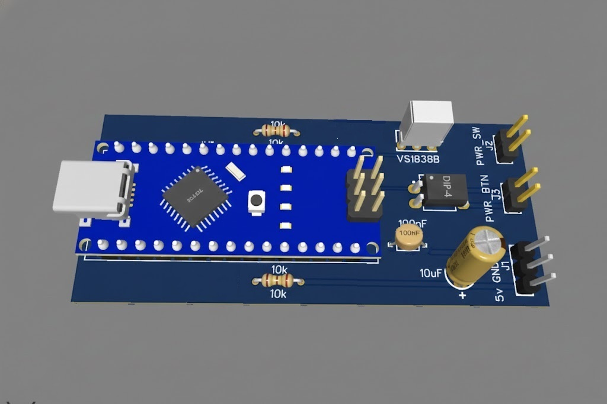
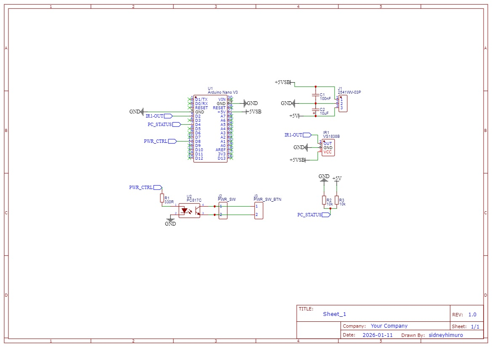
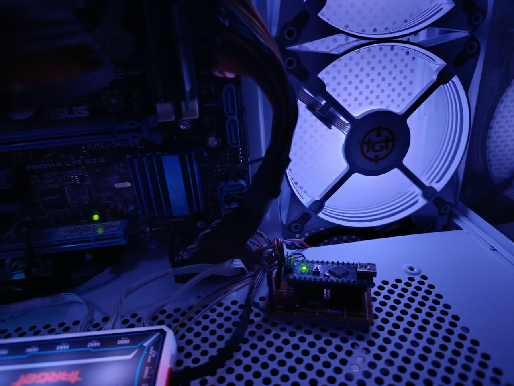
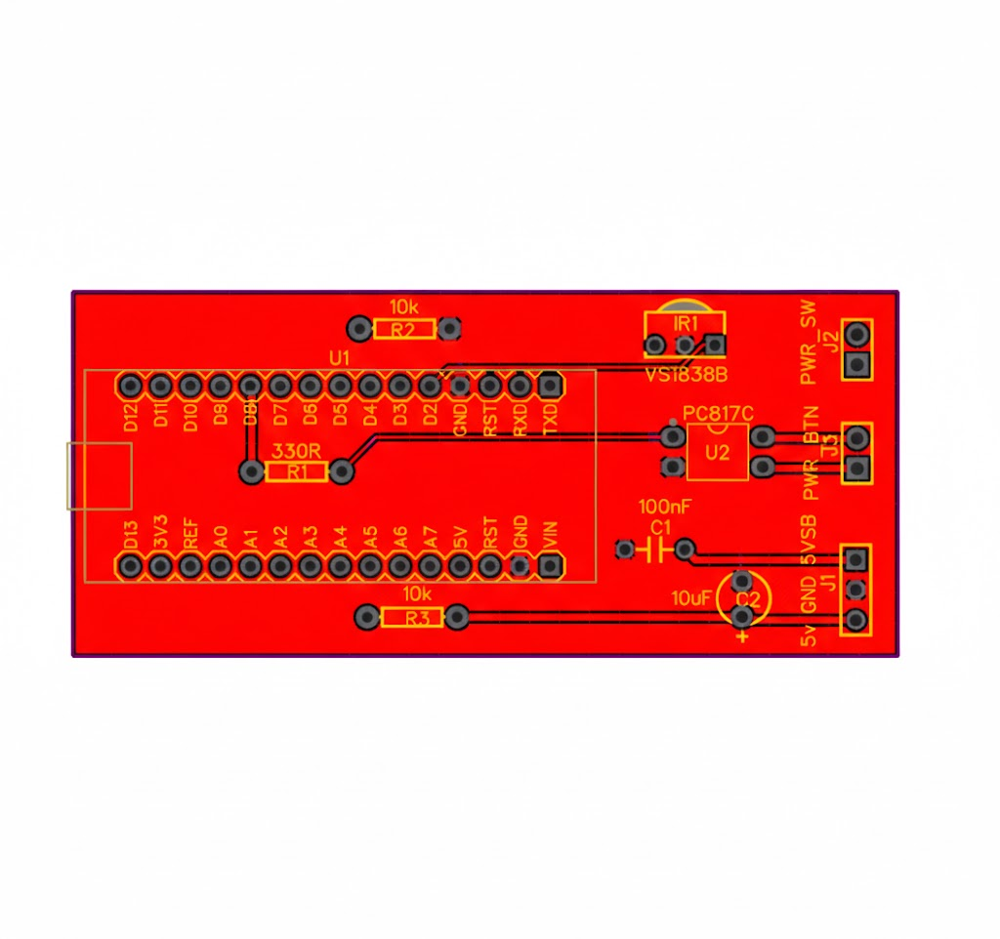
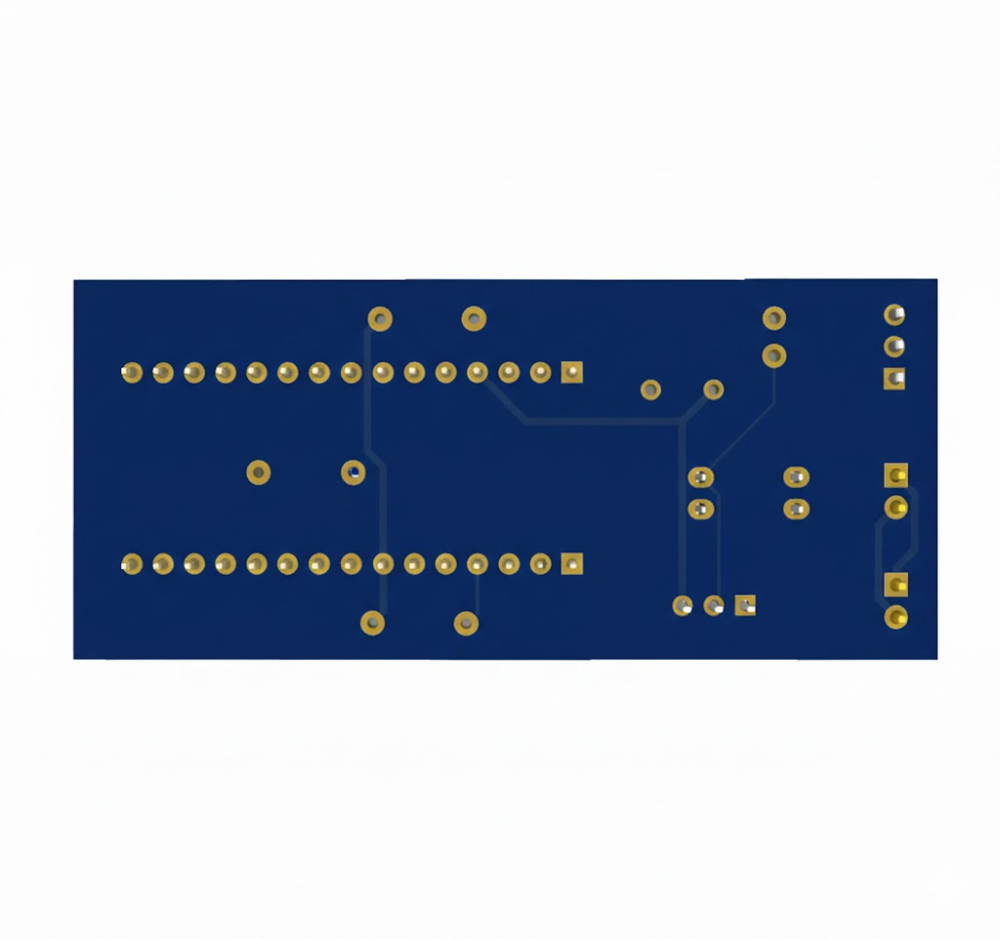

# IR PC Control Project

Infrared remote control system to turn a PC ON and OFF using Arduino, with full electrical isolation from the motherboard and smart safety logic.



---

## 🎯 Project Goal

This project allows controlling a computer POWER button using an infrared remote control, while ensuring:

- Full electrical isolation from the motherboard  
- Standby operation using ATX 5VSB  
- Protection against accidental shutdowns  

---

## 📁 Repository Structure

```text
IR-Controle-PC/
├── src/
│   ├── IRcontrolePC/       # Main firmware
│   └── IRTest/             # IR protocol test sketch
├── pcb/
│   ├── easyeda/            # EasyEDA project files
│   ├── gerber/             # Manufacturing Gerber files
│   └── renders/            # PCB 3D renders
├── docs/
│   └── Projeto_IR_Controle_PC_Documentacao_Final.pdf
├── images/
│   ├── pcb/
│   ├── montagem/
│   ├── funcionamento/
│   └── app/
└── README.md

```
---


---

## 🔧 Hardware Used

- Arduino Nano (powered by 5VSB)
- VS1838B IR Receiver
- PC817 Optocoupler (PWR_SW signal isolation)
- Standard ATX Power Supply
- ATX-compatible motherboard



---

## ⚙️ System Operation

The Arduino remains powered in standby mode through the ATX 5VSB rail.  
A dedicated Arduino pin monitors the presence of 5V to determine whether the PC is ON or OFF.

Infrared commands are received by the VS1838B and processed by the microcontroller.

---

## 🧠 Control Logic

- **PC OFF**
  - 1 button press → POWER signal sent → PC turns ON

- **PC ON**
  - 3 button presses within 5 seconds → POWER signal sent → PC turns OFF



---

## 🔒 Electrical Safety

The motherboard POWER button is driven exclusively through a PC817 optocoupler, ensuring:

- Complete electrical isolation  
- No shared GND between Arduino and motherboard  

---

## 🔋 Power Supply

- **5VSB (purple wire):** continuous power for the Arduino  
- **5V (red wire):** used only as PC status signal  

---

## 💻 Firmware

The firmware uses an IR decoding library to process remote commands.

### IR Remote Identification

1. Upload the `IRTest` sketch  
2. Open the Serial Monitor  
3. Press the desired remote button  
4. Copy the protocol, address, and command values  

These values must be inserted into the main firmware `IRcontrolePC`.

---

## 📱 Smartphone Control

The **Mi Remote** application (or similar IR apps) can replace the physical remote control by using a smartphone's built-in IR transmitter.

> **Note:** "Xiaomi" and "Mi Remote" are trademarks of Xiaomi Inc. This project is independent and has no official affiliation with them.

---

## 📌 Pinout (Arduino Nano)

To make assembly easier, follow the connection table below:

| Component | Arduino Pin | Function |
| :--- | :--- | :--- |
| **VS1838B (OUT)** | D2 | IR Signal Input |
| **PC817 (Anode)** | D3 | Optocoupler Trigger (Power SW) |
| **PC Status (5V)** | D4 | Monitor if PC is ON/OFF from 5V Red cable |
| **VCC** | 5V | Power from 5VSB Purple cable |
| **GND** | GND | GND black cable |

---

## 🖨️ PCB

The PCB was designed using **EasyEDA**, featuring:

- Proper optocoupler isolation  
- Ground plane  
- Correct IR receiver placement  
- Dedicated connectors  




---

## 📄 Documentation

Complete technical documentation is available in PDF format:

📄 `docs/Projeto_IR_Controle_PC_Documentacao_Final.pdf`

---

## 🚀 Possible Expansions

- ESP32 + Wi-Fi  
- Home Assistant integration  
- Custom Android application  
- Home automation systems  

---

## 👤 Author

**Sidney Himuro**

---

## 📜 License

This project is licensed under the **MIT License**.
